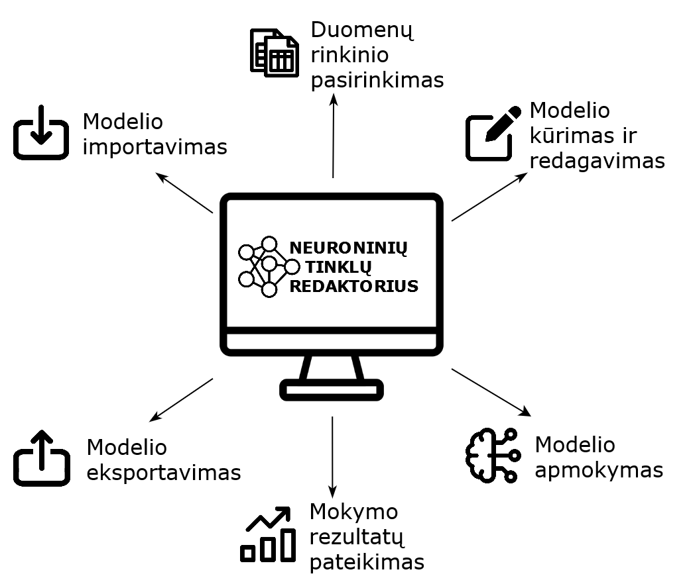
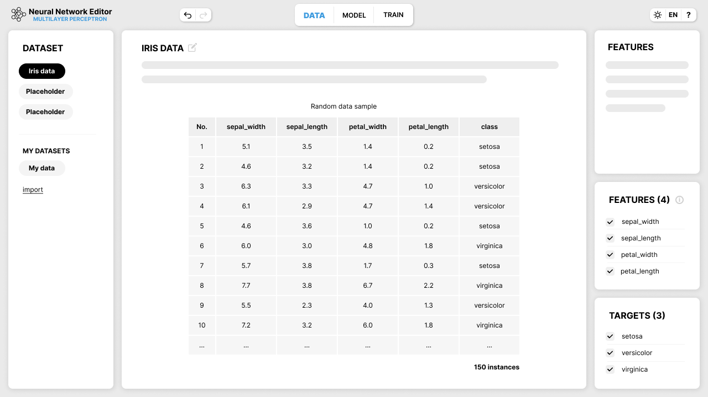
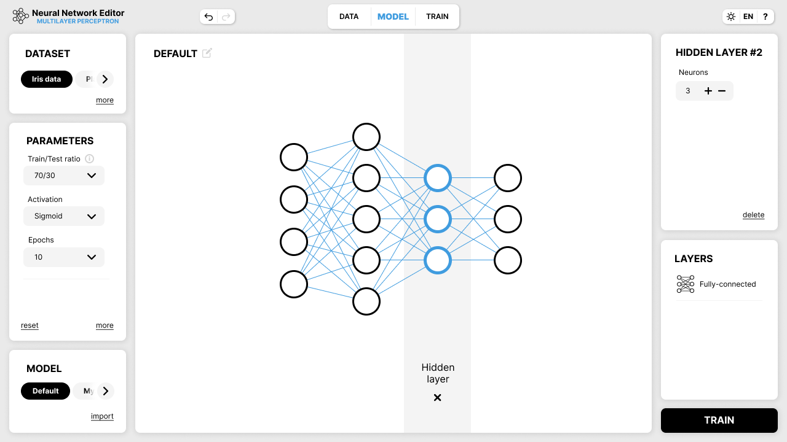
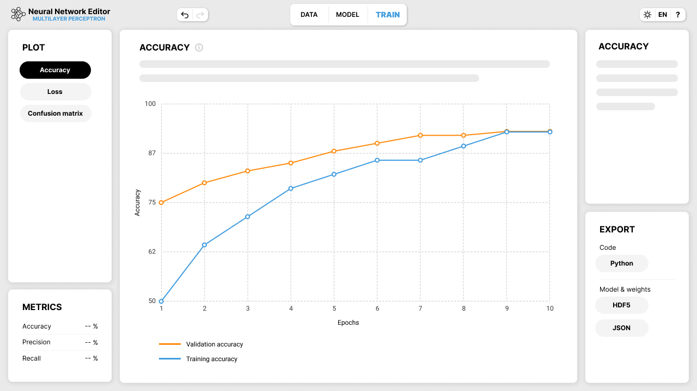

# Neuroninių tinklų redaktorius
Neuroninio tinklo redaktorius – tai edukacinės paskirties įrankis, leidžiantis sukurti ir apmokyti nesudėtingus neuroninius tinklus, naudojant vien tik grafinę sąsają.
## Programos vizija
Siekiama, kad ši sistema įgyvendintų esminius DNT vizualiems redaktoriams būdingus funkcionalumus ir leistų kurti daugiasluoksnio perceptrono struktūros neuroninį tinklą.

## Programos maketas
Neuroninio tinklo redaktorių sudaro trys pagrindinės grafinės sąsajos:
* Duomenų apžvalga (Data)
* Modelio konstravimas ir rengimas mokymui (Model)
* Mokymo apžvalga ir modelio eksportavimas (Train)

### Duomenų apžvalga

### Modelio konstravimas ir rengimas mokymui

### Mokymo apžvalga ir modelio eksportavimas
